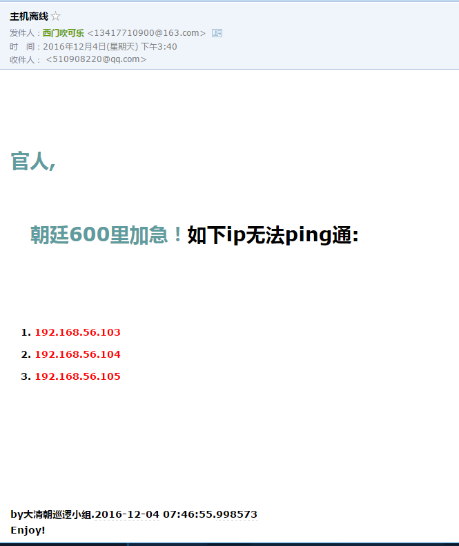

# ping-tool
检测主机是否在线,不在线就发邮件告警.如图:

## 使用说明

- 使用yagmail发送邮件, 如果不是用的gmail,需要显示设置host,user等参数. 我是用的163邮箱,设置可以看代码.
- 代码里我使用的是非SSL协议端口,具体配置可以看这[163邮箱服务器配置](http://help.163.com/09/1223/14/5R7P6CJ600753VB8.html)
- 163登录密码是客户端授权密码